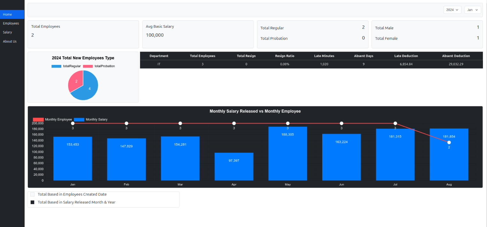
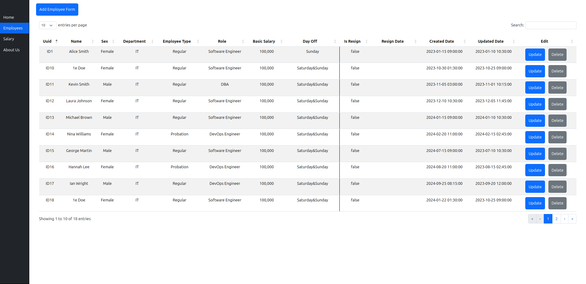
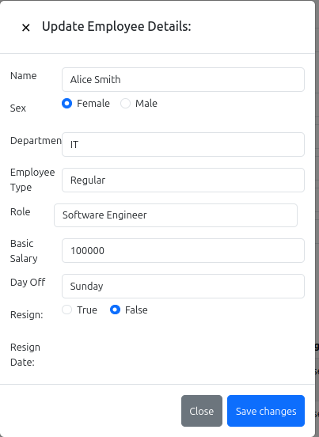
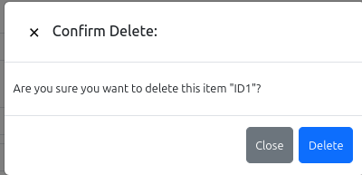
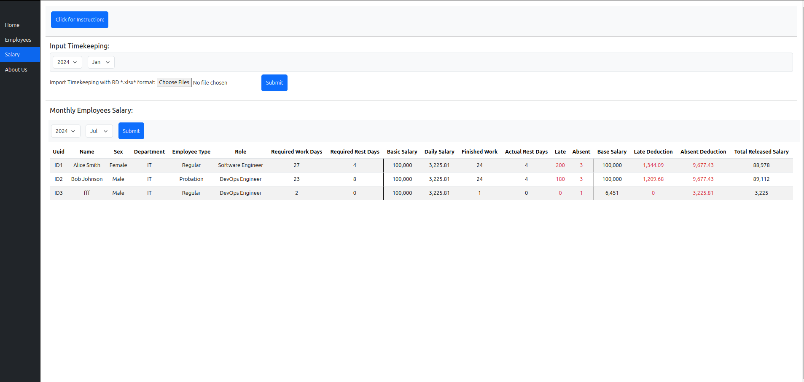
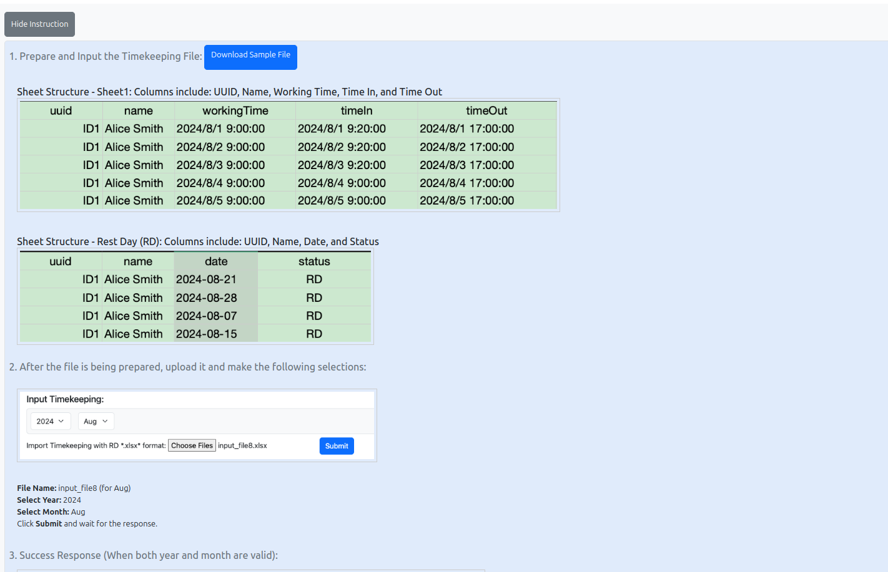

# Company ABC - HR Analytics Dashboard

Details URL: https://docs.google.com/document/d/1JPRlPxJx3uEbbJ61gBRE2rREEI5pHBwXUqDEceo4b6I/edit?tab=t.0

## 1.Home (Dashboard)

### 1.1 Select Year & Month to interact with the dashboard

- Light gray Table (Calculation based in Employees Created/Joined Date) .
  Total Employees, AVG Basic Salary, Total Regular/Probation, Total Male/Female, Yearly Employee Type

- Dark gray Table( Salay released Month & Year) .
  Monthly Salary Released & Monthly Employee
  Monthly Salary Released based in Department with Resign ratio rate , late minutes, absent days, late deduction & absent deduction

## 2.Employees

### 2.1 Add Employee Form

- Name: Min-length 5 & Text Only
- Sex: Male & Female
- Department: HR, Finance & IT
- Employee Type: Regular & Probation ( Masa percobaan)
- Role: Employee apply role/position
- Basic Salary: Employee starting salary
- Day Off: Sunday ( meaning off in sunday), Saturday&Sunday ( off in saturday & sunday)

UUID is unique id with string that start with (“ID” + Primary Key Incremental eg: ID20 ID21 ID22)

Submit to insert New Employee

### 2.2 Update & Delete Employee Details

#### 2.2.1 Update

When Resign is True then resign date will be shown, Save changes to update to MongoDB

### 2.2.2 Delete

## 3. Salary

### 3.1 Instruction

There’s instruction in order to input & upload timekeeping file (Excel file XLSX), You may Download Sample File or check sample dataset for inputting timekeeping file https://github.com/RedimRedim/final_capstone_backend_python/tree/main/app/data
eg input_file8 ( for Aug 2024)

### 3.2 Input Timekeeping:

- File Name: input_file8 (for Aug)
- Select Year: 2024
- Select Month: Aug
- Click Submit and wait for the response.

Response when success and Download Timekeeping CSV button will be shown. Users can download the csv to check how the calculation is being calculated.

Note: You may create timekeeping by yourself for example input_file9 for september as long as follow the instruction and follow the sample file

### 3.3 Query Monthly Employees Salary:

- Select Year & Month => Submit
- UUID = Auto increment (ID + Integer, ID12 ID13)
- Required Work Days + Required Rest Days = Total Days in a month = 30/31 Days
- Required Rest Days = If DayOff => Sunday then employee rest day is every sunday ( Aug total sunday is 4 Days)
- Basic Salary = Employee first landing job salary ( when create in employee’s form)
- Daily Salary = Basic Salary / Total Days in a month
- Finished Work = employee working Time (timeOut - timeIn) that over 320 minutes / 5:30 hours will be counted as finished work
- Actual Rest Days = input_file8 sheet RD

Apart of that, we also making sure API to return error if restDays is over than requiredRestDays

- Late (Minutes) = if timeIn > workingTime then timeIn - workingTime
- Absent = if finishedWork is 0 or totalWorkHours <= 320 then count as absent
- Base Salary = Employee Basic salary when adding new employee form
- Daily Salary = Basic Salary / Total Day in a month
- Late Deduction = Daily Salary / 8 hours / 60 minutes \* Total Late in minutes
- Absent Deduction = Daily Salary \* Absent Days
- Total Released Salary = Base Salary - Late Deduction - Absent Deduction
